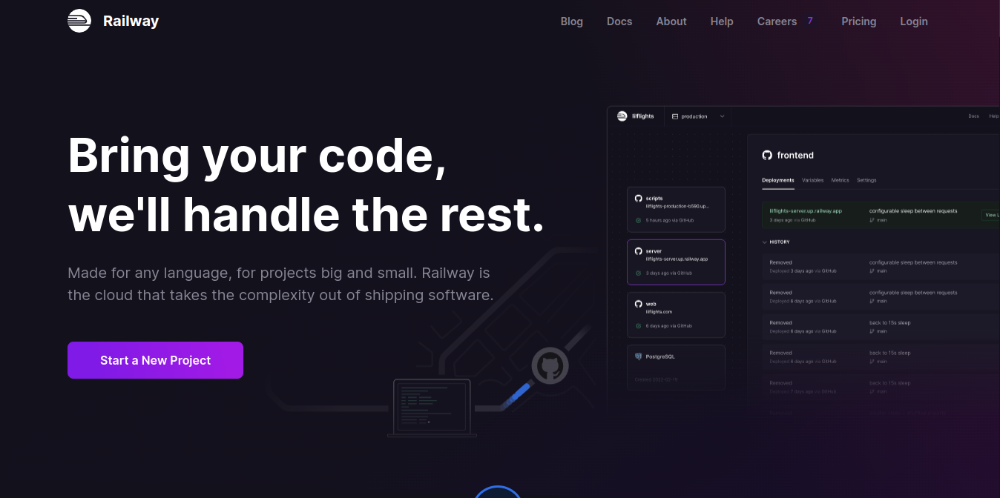
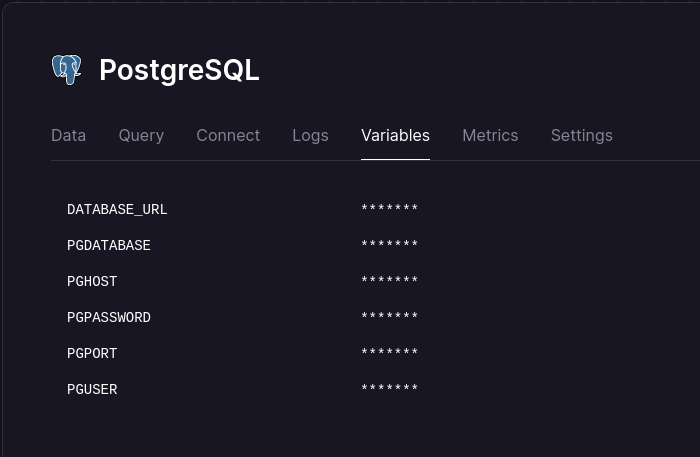

# CRUD Productos
## Requisitos
Tener instalado:
- [Nodejs](https://nodejs.org/en/)
- Algún manejador de paquetes (**npm, pnpm, yarn**), recomendamos **pnpm**.
- [Git](https://git-scm.com/)
## Descargar el proyecto
Clonamos este repositorio:
```bash
git clone https://github.com/wFercho/crud-productos
```
Ingresamos en la carpeta del proyecto:
```bash
cd crud-productos
```

Instalamos los paquetes estando en la carpeta del proyecto:
```bash
pnpm install
# or
npm install
# or
yarn install
```
## Configurar la conexión a base de datos remota (Postgresql)
Haciendo uso de [Railway](https://railway.app/), crearemos un nuevo proyecto con una base de datos Postgresql.





Estas son las variables que usaremos para conectarnos a la base de datos que acabamos de crear.  

Tomando como base los nombres de variables de entorno que están en el archivo .env.example, creamos un archivo con el nombre ".env" o ".env.local", en el que definiremos nuestras variabales de entorno.
```yaml
DB_PORT=
DB_HOST=
DB_USER=
DB_PASSWORD=
DB_NAME=
ID_ARCH_PLANO_DRIVE =
```
En el archivo que acabamos de crear colocamos las variables que tenemos en railway.

## Configurando la conexión a archivo externo (Google Drive)
Para consumir el contenido de un archivo de texto plano, que está alojado en Google Drive: 
1. Creamos un enlace para compartir la vista del documento.
2. De ese enlace inferimos el ID del documento
"https://drive.google.com/file/d/1LSQzDmTCWe3aIL9fkve9lvSEjKdfCHQg/view". Para este caso (siendo 19 de Febrero de 2023), así es como se ve el enlace para la vista del documento. El ID es el que se encuentra después del **"d/"** y va hasta el siguiente **"/"**, en este caso sería "**1LSQzDmTCWe3aIL9fkve9lvSEjKdfCHQg**". Este va en la variable de entorno "**ID_ARCH_PLANO_DRIVE**".
## Ejecutando el servidor de desarrollo
Ejecutamos el servidor en entorno de desarrollo con:
```bash
pnpm run dev
# or
npm run dev
# or
yarn run dev
```

Usando nuestro navegador de preferencia accedemos a:

 [http://localhost:3000/products](http://localhost:3000/products) 

